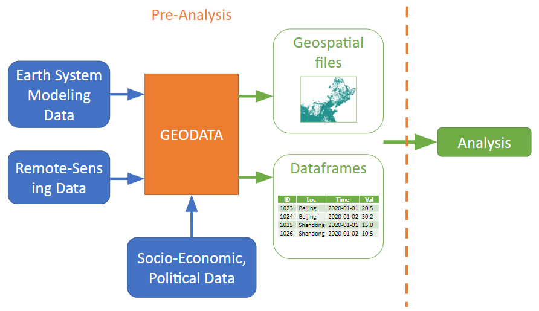

GEODATA
-

**Geodata** is a Python library of geospatial data collection and "pre-analysis" tools. Geospatial and gridded datasets of physical variables are ubiquitous and increasingly high resolution. Long time-series gridded datasets can be generated as part of earth system models, and due to their geographic coverage they can have wider applications, including in engineering and social sciences. Geospatial (GIS) files can encode various physical, social, economic, and political data. However, working with these datasets often has significant startup costs due to their diverse sources, data formats, resolutions, and large file sizes.

Geodata streamlines the collection and use of geospatial datasets through the creation of shared scripts for “analysis-ready” physical variables. Its purpose is to make it easier for researchers to identify, download, and work with new sources of geospatial data. Additionally, with a minimal amount of data consistency checks and metadata information, when one researcher goes through this exercise, everyone benefits.

Geodata builds off the **[atlite](https://github.com/PyPSA/atlite)** library, which converts weather data (such as wind speeds, solar radiation, temperature and runoff) into power systems data (such as wind power, solar power, hydro power and heating demand time series). Atlite was developed by Gorm Andresen, Jonas Hörsch, Tom Brown, Markus Schlott, and David Schlachtberger.  To learn more about atlite and its usage, see the [atlite readme](https://github.com/PyPSA/atlite/blob/master/README.rst) or its [documentation](https://atlite.readthedocs.io/en/latest/introduction.html). Geodata retains the power systems data functionality of atlite.

## Installation

**Geodata** has been tested to run with python3 (>= 3.6.9). It requires a number of libraries to work with netCDF files including `xarray`, `netcdf4` and `dask`. Read the [package setup instructions](doc/general/packagesetup.md) to configure and install the package.

## Documentation

Read the [Introduction to Geodata] documentation(doc/general/Introduction.md) to get started. You can also find a [Table of Content here](doc/general/tableofcontents.md). 

## Contributing

We welcome suggestions for feature enhancements and the identification of bugs. Please make an issue or contact the [authors](https://mdavidson.org/about/] of geodata.

## License

Geodata is licensed under the GNU GENERAL PUBLIC LICENSE Version 3 (2007). This program is free software; you can redistribute it and/or modify it under the terms of the GNU General Public License as published by the Free Software Foundation; either version 3 of the License, or (at your option) any later version. This program is distributed in the hope that it will be useful, but WITHOUT ANY WARRANTY; without even the implied warranty of MERCHANTABILITY or FITNESS FOR A PARTICULAR PURPOSE. See the [GNU General Public License](/LICENSE.txt) for more details.

