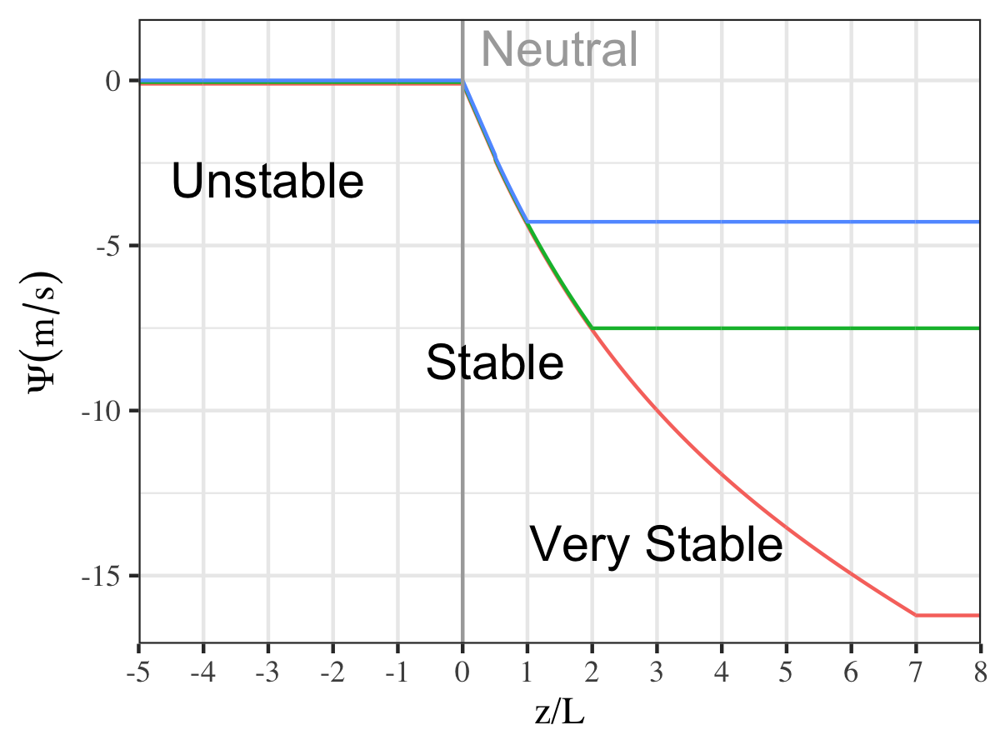

Wind parameterizations
-

_To read/write latex formula, install GitHub add-on: [TeXify](https://github.com/apps/texify)._

## Extrapolation

Extrapolating wind speeds from measured (or modeled) heights to other heights must assume a model of the atmosphere. This is particularly important for studying wind power generation as turbine hub heights can be 50-120m above the ground. Standard approaches include the log law and power law.

Geodata allows users to customize the wind extrapolation function through the `extrap_fn` parameter in the call to `wind.extrapolate_wind_speed()`. By default, the log law ratio (`extrap_fn = log_ratio`) is used.

## Stability correction

Simple extrapolation routines assume neutral stability of the atmosphere, potentially ignoring highly stable or unstable atmospheric conditions that could alter the wind speed profile at certain hours of the day.

**`L` Obukhov length**

Most stability correction functions rely on the Obukhov length, which can be calculated from available parameters [[1]](#1):

$L= - \dfrac{u_{* }^{3}\overline{\theta_{v}}\rho_{a}C_p}{\kappa gH_{v0}}$
$H_{v0}=H_{f}+0.61C_{p}\dfrac{\overline{\theta}}{L_{e}}H_{L}$
$\overline{\theta}=\overline{T}\left(p_{0}/p\right)^{\kappa_{p}}$

where $u_{* }$ is the friction velocity,  $\overline{\theta_{v}}$ is the virtual temperature, $\rho_a$ is the density, $C_p$ is the specific heat, $\kappa=0.4$, and $H_{v0}$ is the virtual heat flux in terms of sensible and latent heat fluxes (negative if directed upwards).

**$\psi_m$ Stability correction**

Extrapolated wind speeds are "corrected" via a stability correction function $\psi_m$ according to:

$u'(z) = u(z) - \psi_m(z/L)$

where $\psi_m(z/L)$ takes different forms in the literature [[2]](#2).

Geodata has the following stability correction functions installed (in terms of the parameter $z/L$):
- `psi_linear`: linear for positive parameters (This function does not perform well for high $z/L$)
- `psi_linearexp`: piecewise linear-exponential
- `psi_linearexpconst`: piecewise linear-exponential with maximum constant correction, illustrated here for various constants:

## References

<a id="1">[1]</a> Rose, S., & Apt, J. (2016). Quantifying sources of uncertainty in reanalysis derived wind speed. Renewable Energy, 94, 157–165. https://doi.org/10.1016/j.renene.2016.03.028

<a id="2">[2]</a> Sharan, M., & Aditi. (2009). Performance of various similarity functions for nondimensional wind and temperature profiles in the surface layer in stable conditions. Atmospheric Research, 94(2), 246–253. https://doi.org/10.1016/j.atmosres.2009.05.014
