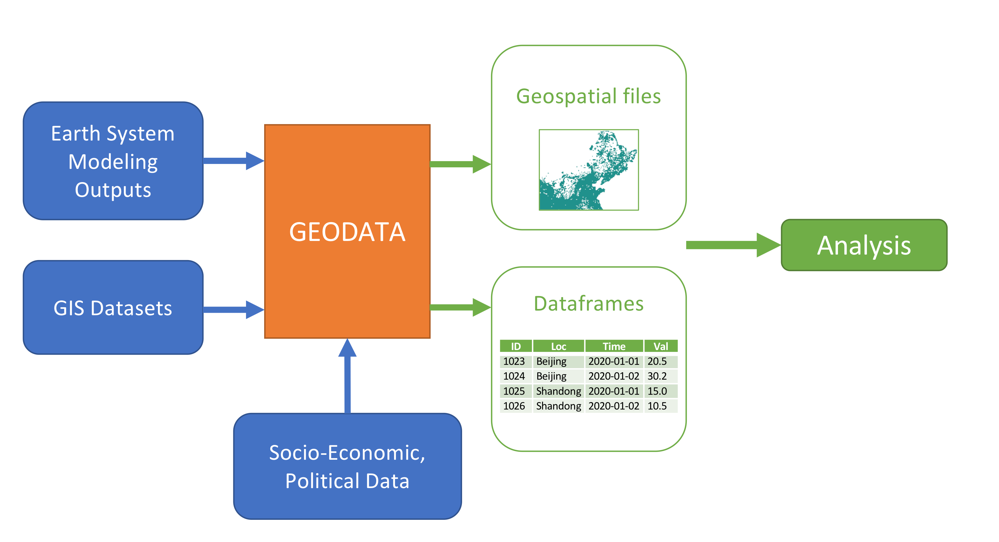
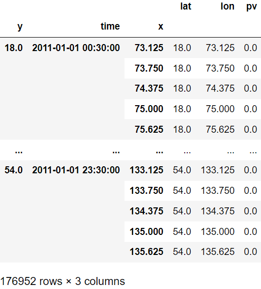
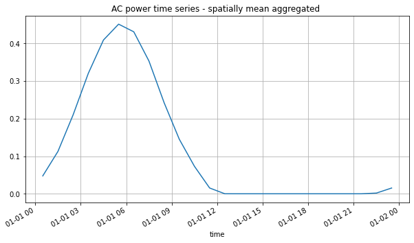
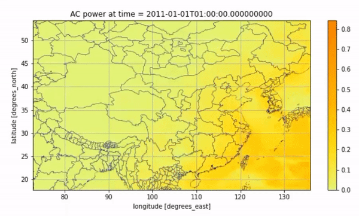
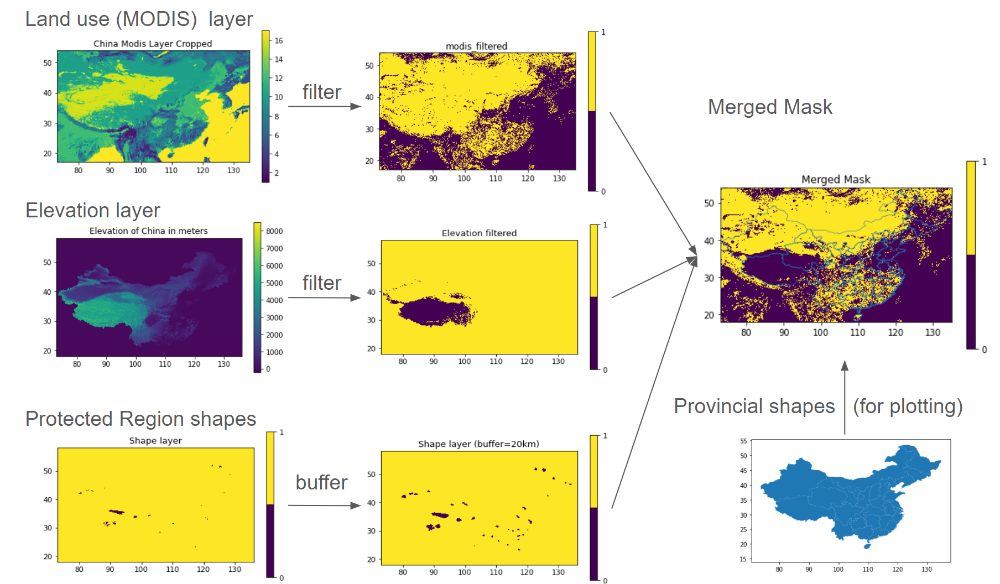
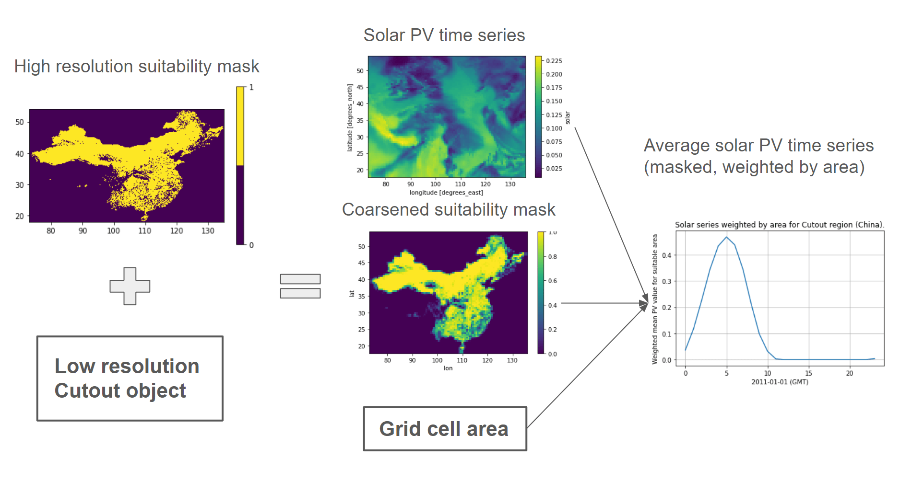

**Geodata** is a Python library of geospatial data collection and
“pre-analysis” tools. Through the creation of shared scripts and
documentation for analysis-ready physical variables, geodata streamlines
the collection and use of geospatial datasets for natural science,
engineering, and social science applications.

   A typical anaylsis workflow with Geodata

Motivation
----------

The main motivation is the difficulty in working with high temporal and
spatial resolution datasets of physical variables from earth system
models and combining them with GIS datasets (land use, geographic
features, etc.). The primary analytical questions addressed here are
generating profiles of variables of interest (solar PV, wind power,
pollution distribution) subject to suitability and weighting criteria.
Additional applications are under development.

Working with these datasets has startup costs and computational barriers
due to diverse sources, formats, resolutions, and large memory
requirements. To solve this, **Geodata** provides an all-in-one Python
interface for downloading, subsetting, and transforming large earth
systems datasets into relevant physical variables and flexibly
incorporating GIS datasets to mask these variables and generate
“analysis-ready” datasets for use in regression, plotting, or energy
model inputs. Additionally, with a minimal amount of data consistency
checks and metadata information, when one researcher goes through this
exercise, everyone benefits.

How To Use
----------

Download Datasets
~~~~~~~~~~~~~~~~~

Earth system datasets can be large (100+ MB / file with hundreds of
files necessary for a single analysis) and their APIs and file
structures (e.g., daily vs monthly) vary by source. Utilizing xarray and
dask data parallelization, Geodata provides single call download with
API credentials stored locally. Data requests are automatically trimmed
to keep only required variables, significantly reducing bandwidth
requirements and disk usage.

Geodata currently supports MERRA-2 and ERA5 reanalysis products and
various GIS file formats (see :doc:`here<general/input_output>`).
For example, to evaluate solar PV availability using
`MERRA2 <https://disc.gsfc.nasa.gov/datasets/M2T1NXRAD_5.12.4/summary&sa=D&source=docs&ust=1646032882397245&usg=AOvVaw1WJVA5CNhT-7x_XWIA58o5>`__
on 01/01/2011, use the following method call:

.. code :: Python

   from geodata import Dataset

   solar = Dataset(
      module="merra2", 
      years= slice(2011, 2011),
      months=slice(1,1),
      weather_data_config="slv_radiation_hourly"
   )
   solar.get_data()

Extract Cutouts
~~~~~~~~~~~~~~~

Most energy analyses (e.g., energy models, resource assessments,
political economy studies) require time series on subsets of locations
and time periods. Geodata can extract desired variables, time periods,
and geographies from the dataset to a Cutout object. We then call various functions in
``geodata.convert`` module to transform the raw data into analysis-ready
variables with the option to export to CSV or combine with other GIS
datasets through further masking analysis.

After downloading the required
`MERRA2 <https://disc.gsfc.nasa.gov/datasets/M2T1NXRAD_5.12.4/summary&sa=D&source=docs&ust=1646032882397245&usg=AOvVaw1WJVA5CNhT-7x_XWIA58o5>`__
dataset, we create a Cutout object that contains solar irradiance over
China.

.. code :: Python

   from geodata import Cutout

   cutout = Cutout(
      name="china-2011-slv-hourly-test",
      module="merra2",
      weather_data_config="slv_radiation_hourly",
      xs=slice(73, 136),
      ys=slice(18, 54),
      years=slice(2011, 2011),
      months=slice(1, 1),
   )
   cutout.prepare()

Then, we can convert the downward-shortwave, upward-shortwave radiation
flux, and ambient temperature variables from the Cutout data into a PV
generation time-series using the geodata ``convert`` method. Geodata
stores objects internally as an xarray DataArray, which can be easily
converted to a Pandas DataFrame.

.. code :: Python

   from geodata import convert

   ds_solar = convert.pv(cutout, panel="KANEKA", orientation="latitude_optimal")
   ds_solar.to_dataframe(name="pv")

   Output of the code above

We can plot a time series of average PV values for all grid cells on
that day with geodata's visualization method:

.. code :: Python

   from geodata import plot

   plot.time_series(ds_solar)

   Visualization of the average PV values over time

We can also visualize the average solar PV for every two hours on this
day through an animation:

.. code :: Python

   import geopandas as gpdø

   from geodata import plot

   prov_shapes = gpd.read_file(prov_shapes_path)
   geodata.plot.heatmap_animation(
      ds_solar,
      cmap="Wistia",
      time_factor=2,
      shape=prov_shapes,
      shape_width=0.25,
      shape_color="navy",
   )

   Animated Result

Masking
~~~~~~~

Geographic masks help filter datasets for specific analyses. Geodata is
able to process GIS datasets and extract cutouts over specified
geographies. Built off the open-source binary libraries GDAL, GEOS, and
PROJ, and Python libraries rasterio and shapely, the Mask module imports
rasters and shapefiles, edits them as mask layers, merges and flattens
multiple layers together, and extracts subsetted cutout data from merged
masks and shapefiles.

For example, within Geodata the user can load the `MODIS land use
dataset <https://developers.google.com/earth-engine/datasets/catalog/MODIS_006_MCD12Q1#bands>`__,
the `elevation
dataset <https://developers.google.com/earth-engine/datasets/catalog/CGIAR_SRTM90_V4?hl=en>`__,
and `environmental protected
shapes <https://www.protectedplanet.net/country/CHN>`__, filter these
according to solar energy suitability criteria, and merge into a single
binary siting mask, where values of 0 represent the unsuitable area, and
values of 1 represent the suitable area. Masks can be saved locally for
later use.

Geodata automatically reprojects GIS data in different coordinate
reference systems into degree coordinates for processing. Common
manipulations include cropping, filtering on categorical values,
filtering on thresholds, excluding small contiguous areas, and filtering
by shape buffers. One multi-purpose plotting function (``mask.show``)
supports visualizing the mask including relevant shape boundaries.

For example, Geodata can create a binary mask of wind energy suitability
in China based on the above GIS inputs.

.. code :: Python

   import geopandas as gpd

   from geodata import mask

   china = mask.Mask("China")
   china.add_layer(layer_path={"modis": modis_path, "elevation": elevation_path})

   protected_area_shapes = gpd.read_file(protected_area_shapes_path)
   china.add_shape_layer(
      protected_area_shapes["geometry"].to_dict(),
      reference_layer="elevation",
      combine_name="protected",
      buffer=20,
   )

   china.filter_layer(
      "modis", binarize=True, values=[6, 7, 8, 9, 10, 11, 12, 14, 15, 16, 17]
   )
   china.filter_layer("elevation", binarize=True, max_bound=4000)
   china.merge_layer(trim=True)

   china_prov_shapes = gpd.read_file(china_prov_shapes_path)
   mask.show(china.merged_mask, shape=china_prov_shapes["geometry"], title="Merged Mask")

   china.save_mask()

   Visualization of Mask Workflow

In the final step, we apply the Mask object to the Cutout. Geodata
automatically coarsens the (typically) high-resolution Mask into the
same resolution as the Cutout, adding fractions of the coarse cells
covered by the Mask and areas calculated via an equal-area projection.

.. code :: Python

   ds_cutout = convert.pv(
      cutout, panel="KANEKA", orientation="latitude_optimal"
   ).to_dataset(name="solar")

   cutout.add_mask("china")
   cutout.add_grid_area()
   ds_mask = cutout.mask(dataset=ds_cutout)["merged_mask"]

   weighted_mean_pv_series = (
      (ds_mask["solar"] * ds_mask["mask"] * ds_mask["area"]).sum(axis=1).sum(axis=1)
   ) / (ds_mask["mask"] * ds_mask["area"]).sum()

   plt.plot(weighted_mean_pv_series)

   Mask-Cutout Workflow

What's next?
============

To further explore the capabilities of Geodata, check out the table of contents on the left!
