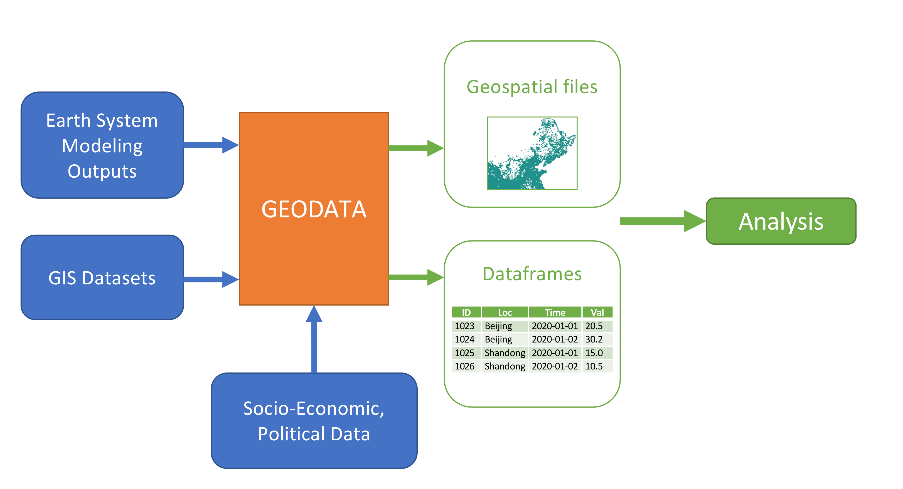

**Geodata** is a Python library of geospatial data collection and
“pre-analysis” tools. Through the creation of shared scripts and
documentation for analysis-ready physical variables, geodata streamlines
the collection and use of geospatial datasets for natural science,
engineering, and social science applications.

   A typical analysis workflow with Geodata

Motivation
----------

The main motivation is the difficulty in working with high temporal and
spatial resolution datasets of physical variables from earth system
models and combining them with GIS datasets (land use, geographic
features, etc.). The primary analytical questions addressed here are
generating profiles of variables of interest (solar PV, wind power,
pollution distribution) subject to suitability and weighting criteria.
Additional applications are under development.

Working with these datasets has startup costs and computational barriers
due to diverse sources, formats, resolutions, and large memory
requirements. To solve this, **Geodata** provides an all-in-one Python
interface for downloading, subsetting, and transforming large earth
systems datasets into relevant physical variables and flexibly
incorporating GIS datasets to mask these variables and generate
“analysis-ready” datasets for use in regression, plotting, or energy
model inputs. Additionally, with a minimal amount of data consistency
checks and metadata information, when one researcher goes through this
exercise, everyone benefits.

How to use
----------

Overview
~~~~~~~~

The recommended workflow follows four steps:

1. **Load and download** a registered dataset with ``load_dataset``.
2. **Run a model** (wind or solar PV) to produce xarray outputs.
3. **Apply a mask** (optional) with ``XarrayMask`` on model output.
4. **Analyze or visualize** the results in xarray, pandas, or with
   ``geodata.plot``.

Geodata supports ERA5 reanalysis through ``load_dataset`` and common GIS
formats (see :doc:`quick_start/input_output`). For dataset setup and configs,
see :doc:`datasets/overview`. MERRA-2 cutout workflows are documented under
:doc:`/legacy/index`.

.. note::

   If you rely on the older ``Dataset`` / ``Cutout`` / ``convert`` API,
   see :doc:`legacy/workflow`.

Step 1: Load and download a dataset
~~~~~~~~~~~~~~~~~~~~~~~~~~~~~~~~~~~

Earth system datasets can be large (100+ MB per file, with many files
per analysis). The ``geodata.datasets`` module provides a unified
interface: pick a registered config, instantiate the dataset class, and
download only the variables and time range you need.

.. code :: Python

   from geodata.datasets import load_dataset

   ds_cls = load_dataset("wind_3d_hourly")
   ds = ds_cls(
      years=slice(2016, 2016),
      months=slice(1, 1),
      bounds=[-10, 35, 10, 45],  # optional bounding box
   )

   if not ds.downloaded:
      ds.download()

   print(ds.downloaded)

Use ``list_datasets()`` to see all registered configs. For ERA5 CDS
credentials and offline test fixtures, see :doc:`datasets/era5` and
:doc:`development/offline-era5-fixture-datasets`.

Step 2: Run a model
~~~~~~~~~~~~~~~~~~~

Models operate on downloaded datasets and return **xarray** objects.
Import the model explicitly (models are not re-exported at the top-level
``geodata`` namespace).

**Wind** — interpolate or extrapolate hub-height wind speed and capacity
factor from ERA5 3D wind data:

.. code :: Python

   from geodata.model.wind import WindInterpolationModel

   model = WindInterpolationModel(ds)
   model.prepare()
   wind_speed = model.estimate(height=100.0)

See :doc:`modeling/wind/index` for wind interpolation and turbine capacity factor, and
turbine capacity-factor details.

**Solar PV** — estimate AC power and capacity factor with pvlib-backed
models on ERA5 wind/solar hourly data:

.. code :: Python

   from geodata.datasets import load_dataset
   from geodata.model.pvlib import Pvlib

   solar_cls = load_dataset("wind_solar_hourly")
   solar_ds = solar_cls(years=slice(2016, 2016), months=slice(1, 1))
   if not solar_ds.downloaded:
      solar_ds.download()

   pv_model = Pvlib(solar_ds)
   # configure pv_system and model config — see modeling/pvlib/index
   cf = pv_model.estimate(years=slice(2016, 2016), months=slice(1, 1))

See :doc:`modeling/pvlib/index` for full PV system and ModelChain setup.

Step 3: Apply a mask (optional)
~~~~~~~~~~~~~~~~~~~~~~~~~~~~~~~~

Mask **creation** uses ``geodata.Mask`` (see
:doc:`mask/mask_creation_workflow`). To apply a saved mask to model
output without a ``Cutout``, use ``XarrayMask``:

.. code :: Python

   from geodata import XarrayMask

   xmask = XarrayMask.from_name("my_mask", grid=wind_speed)
   masked = xmask.apply(wind_speed, mode="where")

See :doc:`mask/xarray_mask_tutorial` for ``attach``, ``apply``, and
grid-area weighting.

Step 4: Visualize
~~~~~~~~~~~~~~~~~

Plotting works on any xarray object returned by a model:

.. code :: Python

   from geodata import plot

   plot.time_series(wind_speed)

See :doc:`visualization/visualization` for heatmaps and animations.

What's next?
============

Use the table of contents on the left to go deeper into datasets,
modeling, masking, and the API reference.
